# Prerequisite

Before we will start the exercise you will need to go to IBM Cloud Shell to get ready to use environment : https://workshop.shell.cloud.ibm.com/
You will have to login with your IBM Cloud user and then use the password : ikslab


1) Select the account with the openshift cluster.
2) Start the terminal.

Now that you have terminal to use with everything you needed install.
Go to your cluster [IBM Cloud clusters dashboard](https://cloud.ibm.com/kubernetes/clusters) Click on the cluster and then on the `Openshift web console`.
Copy the login command from OpenShift web console :


Paste the command in the Cloud Shell in order to be conected to the cluster.


# Exercise 1: Deploying your first Openshift application

In this exercise you will deploy a simple Springboot application. we will use this app to demonstrate key Openshift features.
Also this example will be a build up for the next exercises where we will deploy a Cloud Native application.

for this exercise you will use this git repo: https://github.com/tal2k4xj/microservices-java

## Deploy Springboot app

Access your cluster on the [IBM Cloud clusters dashboard](https://cloud.ibm.com/kubernetes/clusters). Click the `OpenShift web console` button on the top-right. (This is a pop-up so you'll need to white list this site.)

Create a project, give it a name "tutorial".


Click on your new project. You should see a view that looks like this:


Click on the import YAML/ JSON button.

Copy and paste the [deployment.yml](https://github.com/tal2k4xj/microservices-java/blob/master/hello-springboot/kubernetes/deployment.yml) from our git.
It will look like :

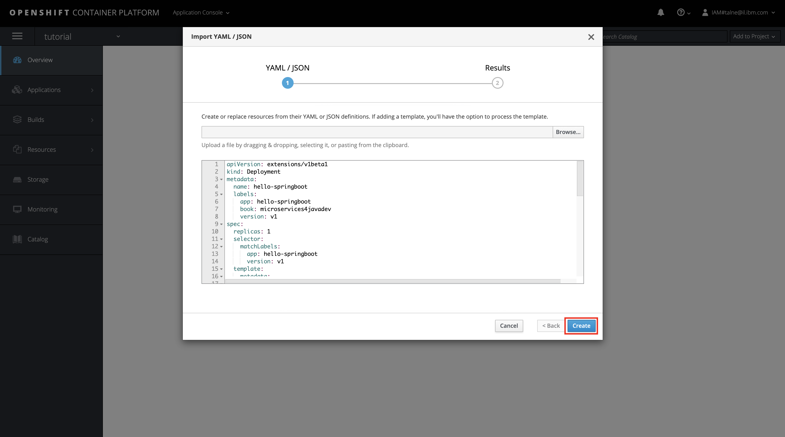

Click Create & Close.

As you can see we have our hello-springboot application up and ready, but we cannot access it because we miss a resource called Service which is how kubernetes handle the routing and requests for each deployment.
In order to create the service we will do the same and import another yml file.

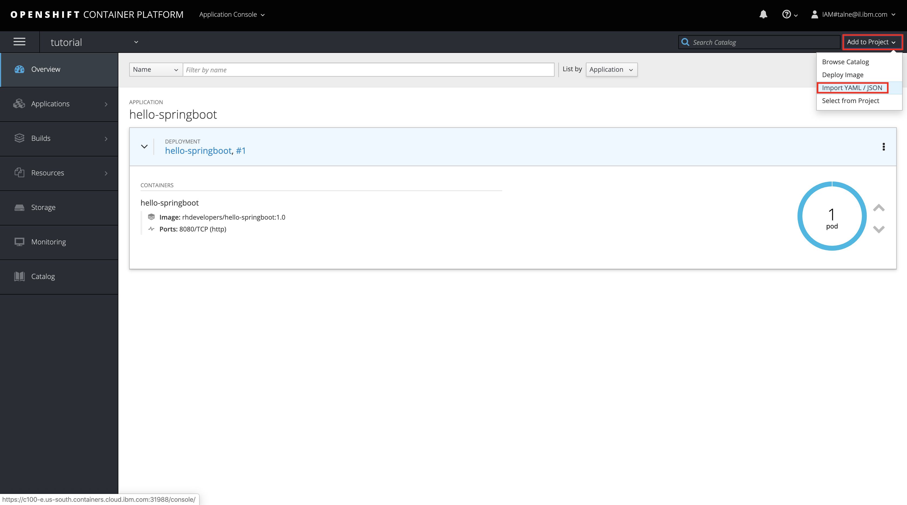

Copy and paste the [service.yml](https://github.com/tal2k4xj/microservices-java/blob/master/hello-springboot/kubernetes/service.yml) from our git.
It will look like :

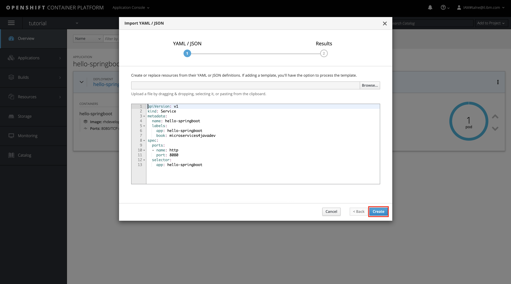

Click Create & Close.

Now you can see that we have a networking service which do port forwarding 8080 -> 8080, but we still cannot access our deployment because this service type is ClusterIP and is only available inside the cluster and cant get outside traffic.
To change that we can create something called Route which is extension that OpenShift give on top of kubernetes and it give us an external traffic route to our service.

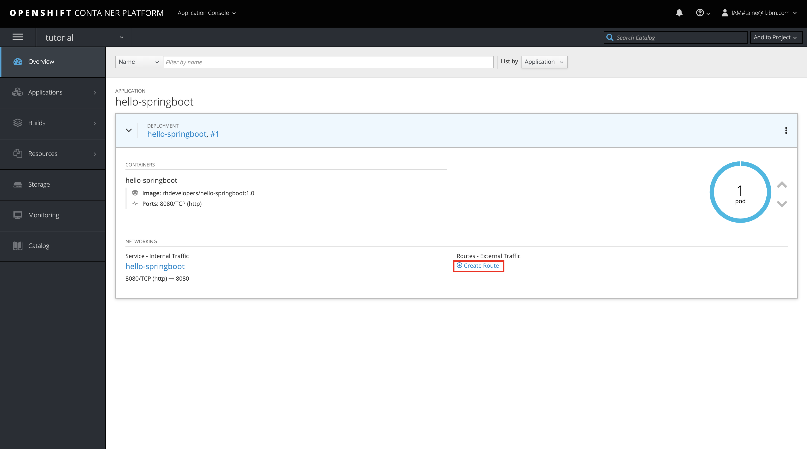
 
Add the path `/api` to create a specific link to our application api path.
Scroll down and click Create.

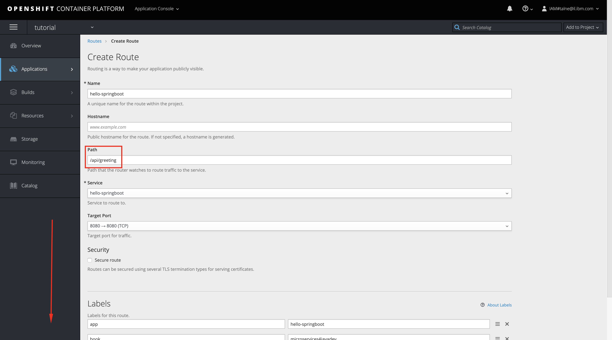

You can see we have now a Route that we can use to interact with our application :

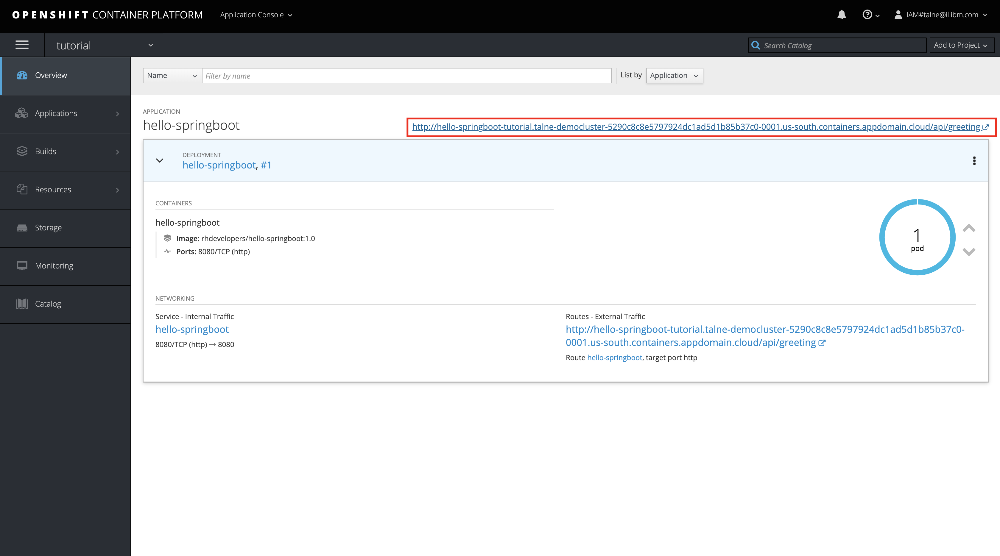

Lets sum up what we did by now, we created a deployment with one pod exposed it with a service inside the cluster and added a route to enable external traffic.
Lets explore our deployment more, go to `Applications -> Deployments` :

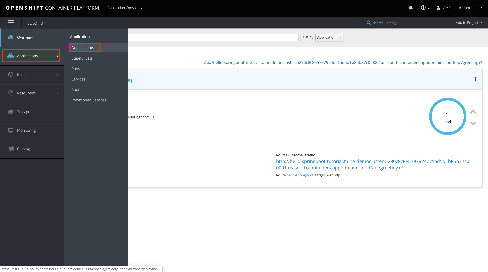

Select the deployment and then select the version (we have only #1), and you should see this :

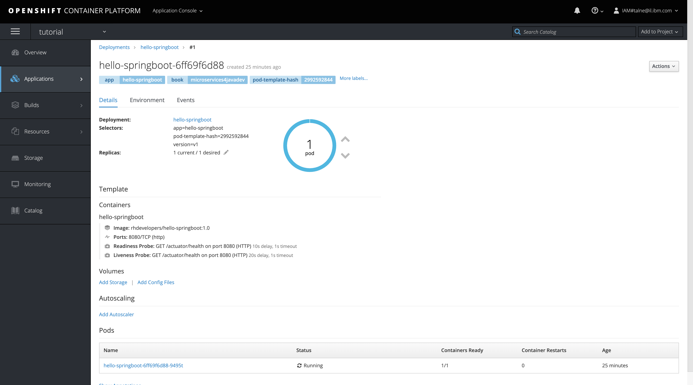

We can scale our application, get information about it state and make live changes if we need.

## Deploy Gateway, Backend & Microprofile app 
As we would like to take our application further and make it a cloud native application we are going to face few more obstacles on the way.
To make sure we are doing the right steps we better take a loot at the [12 factors](https://12factor.net/), those rules will help you better understand what you need to have in order to create a cloud native application.
In the next two exercises we are going to use few of the factors including: Config, Backing services, Processes & Concurrency.

So for the first step we would like to create our Gateway which is using Apache Camel to route our requests asynchronously between two other microservices (Springboot and Microprofile) in order to have one way to interact our application using api.

To do that we will use the cloud shell and not the UI as we did before, go to the [Shell](https://workshop.shell.cloud.ibm.com/) and paste the following commands:

```
$ oc create -f http://raw.githubusercontent.com/tal2k4xj/microservices-java/master/api-gateway/kubernetes/deployment.yml
$ oc create -f http://raw.githubusercontent.com/tal2k4xj/microservices-java/master/api-gateway/kubernetes/service.yml
```

Once both deployment & service created we can go back to the Openshift web console and see them.

Lets do the same with our Microprofice service and our Backend and copy & paste the following commands:

Create Microprofile: 
```
$ oc create -f http://raw.githubusercontent.com/tal2k4xj/microservices-java/master/hello-microprofile/kubernetes/deployment.yml
$ oc create -f http://raw.githubusercontent.com/tal2k4xj/microservices-java/master/hello-microprofile/kubernetes/service.yml
```

Create Backend: 
```
$ oc create -f http://raw.githubusercontent.com/tal2k4xj/microservices-java/master/backend/kubernetes/deployment.yml
$ oc create -f http://raw.githubusercontent.com/tal2k4xj/microservices-java/master/backend/kubernetes/service.yml
```

Once you done check that everything is set by using the `get` command :
```
$ oc get all
```

When you are all set lets take a look at some kubernetes functionality, what will happend if we delete a pod?
Lets try that, Copy the springboot pod name from the `get` command and use the following command:
```
$ oc delete pod hello-springboot-<insert-random-number>
```

As fast as you can do the `get` command again and see what happend :
```
	talne@cloudshell:~$ oc delete pod hello-springboot-6ff69f6d88-9495t 
	pod "hello-springboot-6ff69f6d88-9495t" deleted
	talne@cloudshell:~$ oc get all
	NAME                                      READY     STATUS              RESTARTS   AGE
	pod/api-gateway-5875c48975-49k8k          1/1       Running             0          11m
	pod/backend-6547d9fc69-p6f89              1/1       Running             0          4m
	pod/hello-microprofile-84789d8754-6jzzm   1/1       Running             0          4m
	pod/hello-springboot-6ff69f6d88-s79w9     0/1       ContainerCreating   0          6s
```

As you can see we really deleted our pod, but kubernetes know what state we are looking for and automatically will create new one to make our application up again.
Lets try to access our application from the our Gateway, to do that we will need to expose our gateway and enable external traffic using route as we did before.
Copy & paste the following command to do that:
```
$ oc expose service api-gateway --path=/api/gateway
```

Go to the web console and click on the Gateway Route.
You will probably get this :
```
["Hello at host hello-microprofile-84789d8754-6jzzm - (fallback)","Hello Spring Boot at host hello-springboot-6ff69f6d88-s79w9 - (fallback)"]
```

What just happend? we accessed gateway that automatically send two asynchronous requests to both services Springboot and Microprofile, then both services try to connect to our backend services which is not able to run (dont know if you noticed :)), which cause them to fallback and send their own hello message instead of the backend hello message.
This way we always make sure that our Microservice is resilient and will always work even if he gets errors / timeouts from another services.

To get the backend hello message we want to help the backend pod to run, to do that we will need to run the following command :
```
$ oc adm policy add-scc-to-user anyuid -z default
```

This is not a command you would like to do on your environment because its kind of a security brigde, its allow the container that run on your platform use root privileges and access everything they need, which is what our backend service trying to do and fail.


Now that everything is working lets scale our backend from the UI or you can just copy & paste the command :
```
$ oc scale deployment backend --replicas=3
```

Go back to your Gateway Route and see what happend now :
```
["Hello from cluster Backend at host: 172.30.184.126","Hello Spring Boot from cluster Backend at host: 172.30.184.122"]
```

Now you can see that you get the backend hello message with an ip address, but wait we said that both Springboot and Microprofile are requesting from the same backend, how it is possible to have two different ip addresses ?
So it is possible because we did one thing which is very important, we scaled the application to have 3 pods which means we have 3 copies of the same backend service that do exactly the same thing but from different instances.

Lets go to the Backend service in our Openshift web console.

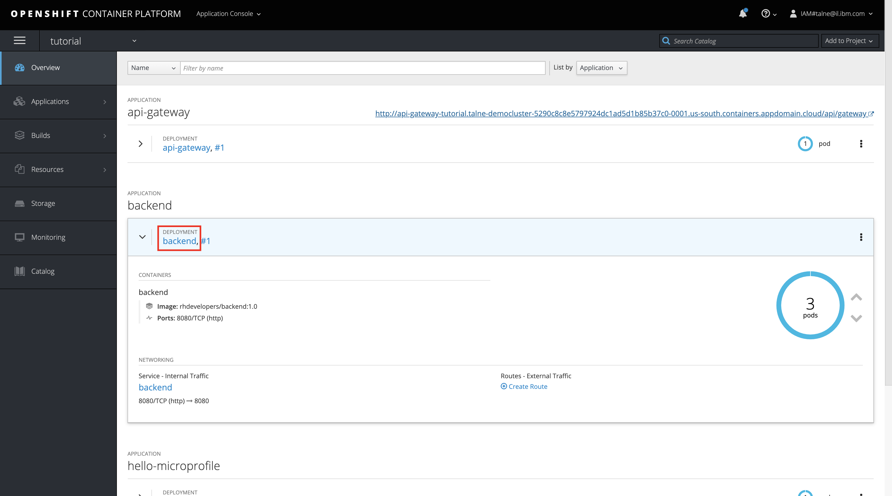

Click on the version name.

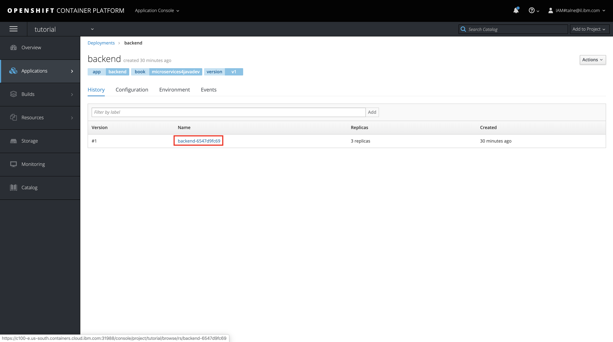

Click on one of the pods.

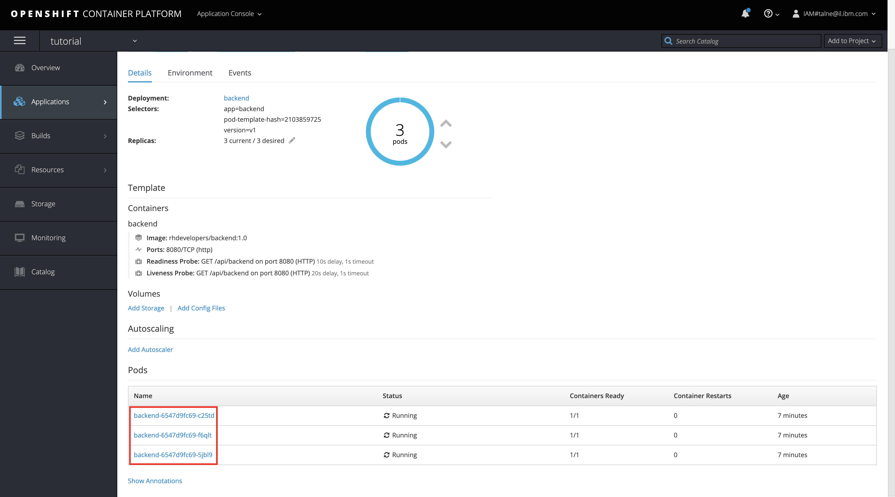

And check if the ip is the same as in the message you got.

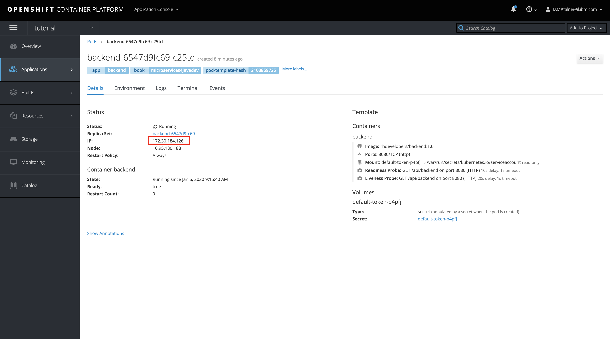

To sum this exercise, we understood the following resources : Projects, Deployments, Services, Routes, Pods.
We also learnd about kubernetes basic functionality and how he always take care of the "current state".
And we learned how to use basic oc cli commands and explored the Openshift web console.

# Exercise 2: Distributed tracing with OpenTracing
This is a short exercise that show you how you cane use simple opensource technologies to have a great control over you environment.
IT and DevOps teams can use distributed tracing to monitor applications. Distributed tracing is particularly well-suited to debugging and monitoring modern distributed software architectures, such as microservices. Developers can use distributed tracing to help debug and optimize their code.

So without further ado let start the exercise by running the following proccess:
```
$ oc process -f http://raw.githubusercontent.com/jaegertracing/jaeger-openshift/master/all-in-one/jaeger-all-in-one-template.yml | oc create -f -
```

As you can see we just created few resources (deployment, 4 services & route):

```
	deployment.extensions/jaeger created
	service/jaeger-query created
	service/jaeger-collector created
	service/jaeger-agent created
	service/zipkin created
	route.route.openshift.io/jaeger-query created
```

Those services could be deployed on any kubernetes environment and serve our needs.
Now we will need to make sure our application know about the existing of those services, we will do that by adding a Configmap which is a key-value configuration file that is part of the kubernetes resources.
```
$ oc create -f http://raw.githubusercontent.com/tal2k4xj/microservices-java/master/jaeger-config.yaml
```

Now that we have Configmap we need to reset our deployments and add them a reference to this configuration:
```
$ oc set env deployment --all --from=configmap/jaeger-config
```

This command will set all deployments to have reference to this configmap and potentially have the ability to send information to them.

Now lets go to our web console and click on the jaeger route.

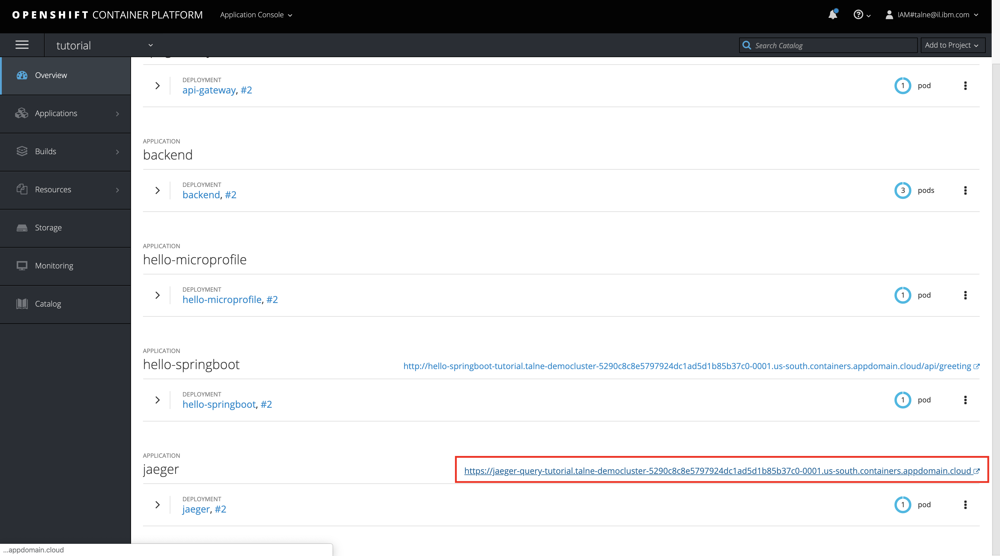

Go to Dependencies -> DAG and you will see your application routing.

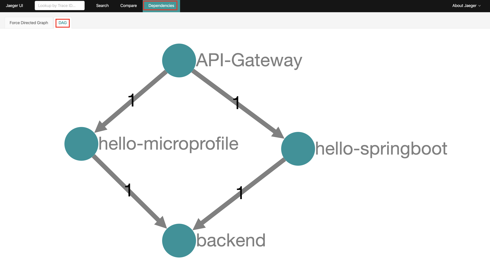

**NOTE: if you dont see it go back to your Gateway Route and click it and go back to jaeger and take a look again.

If you want you can clear the environment by do the following :
```
$ oc delete deploy --all
$ oc delete svc --all
$ oc delete routes --all
$ oc delete configmap --all
```

# Exercise 3: Understand Buildconfig Strategy Options

## What Is a Build?

A build in OpenShift Container Platform is the process of transforming input parameters into a resulting object. Most often, builds are used to transform source code into a runnable container image.
A build configuration, or BuildConfig, is characterized by a build strategy and one or more sources. The strategy determines the aforementioned process, while the sources provide its input.
The build strategies are:
* Source-to-Image (S2I)
* Pipeline 
* Docker 
* Custom 

And there are six types of sources that can be given as build input:
* Git
* Dockerfile
* Binary
* Image
* Input secrets
* External artifacts

## BuildConfig Object Definition

Lets look for a second where is the BuildConfig takes place inside our Openshift cluster.


## Deploying an application using S2I & triggers

In this exercise, you'll deploy a simple Node.js Express application - "Example Health". Example Health is a simple UI for a patient health records system. We'll use this example to demonstrate key OpenShift features throughout this workshop. You can find the sample application GitHub repository here: [https://github.com/IBM/node-s2i-openshift](https://github.com/IBM/node-s2i-openshift)

### Deploy Example Health

Access your cluster on the [IBM Cloud clusters dashboard](https://cloud.ibm.com/kubernetes/clusters). Click the `OpenShift web console` button on the top-right. (This is a pop-up so you'll need to white list this site.)

Create a project, you can title it whatever you like, we suggest "example-health."


Click on your new project. You should see a view that looks like this:


Click on the browse catalog button and scroll down to the `Node.js` image. Click on that catalog button.


Click through to the second step for configuration, and choose `advanced options`. \( a blue hyperlink on the bottom line \)


You'll see an advanced form like this:


Enter the repository: `https://github.com/IBM/node-s2i-openshift` and `/site` for the 'Context Dir'. Click 'Create' at the bottom of the window to build and deploy the application.

Scroll through to watch the build deploying:


When the build has deployed, click the 'External Traffic Route', and you should see the login screen like the following:


You can enter any strings for username and password, for instance `test:test` because the app is running in demo mode.

Congrats! You've deployed a `Node.js` app to Kubernetes using OpenShift Source-to-Image (S2I).

### Understanding What Happened

[S2I](https://docs.openshift.com/container-platform/3.6/architecture/core_concepts/builds_and_image_streams.html#source-build) is a framework that creates container images from source code, then runs the assembled images as containers. It allows developers to build reproducible images easily, letting them spend time on what matters most, developing their code!

### Git Webhooks

So far we have been doing alot of manual deployment. In cloud-native world we want to move away from manual work and move toward automation. Wouldn't it be nice if our application rebuilt on git push events? Git webhooks are the way its done and openshift comes bundled in with git webhooks. Let's set it up for our project.

To be able to setup git webhooks, we need to have elevated permission to the project. We don't own the repo we have been using so far. But since its opensource we can easily fork it and make it our own.

Fork the repo at [https://github.com/IBM/node-s2i-openshift](https://github.com/IBM/node-s2i-openshift)


Now that I have forked the repo under my repo I have full admin priviledges. As you can see I now have a settings button that I can change the repo settings with.


We will come back to this page in a moment. Lets change our git source to our repo.

From our openshift dashboard for our project. Select `Builds > Builds`


Select the patientui build. As of now this should be the only build on screen.


Click on `Action` on the right and then select `Edit`


Change the `Git Repository URL` to our forked repository.

Click Save in the bottom.


You will see this will not result in a new build. If you want to start a manual build you can do so by clicking `Start Build`. We will skip this for now and move on to the webhook part.

Click on `Configuration` tab.

Copy the GitHub Webook URL.

The webhook is in the structure

```text
https://c100-e.us-east.containers.cloud.ibm.com:31305/apis/build.openshift.io/v1/namespaces/example-health/buildconfigs/patientui/webhooks/<secret>/github
```


> There is also the generic webhook url. This also works for github. But the github webhook captures some additional data from github and is more specific. But if we were using some other git repo like bitbucket or gitlab we would use the generic one.

In our github repo go to `Setting > Webhooks`. Then click `Add Webhook`


In the Add Webhook page fill in the `Payload URL` with the url copied earlier from the build configuration. Change the `Content type` to `application/json`.

> **NOTE**: The *Secret* field can remain empty.

Right now just the push event is being sent which is fine for our use.

Click on `Add webhook`


If the webhook is reachable by github you will see a green check mark.

Back in our openshift console we still would only see one build however. Because we added a webhook that sends us push events and we have no push event happening. Lets make one. The easiest way to do it is probably from the Github UI. Lets change some text in the login page.

Path to this file is `site/public/login.html` from the root of the directory. On Github you can edit any file by clicking the Pencil icon on the top right corner.


Let's change the name our application to `Demo Health` (Line 21, Line 22). Feel free to make any other UI changes you feel like.


Once done go to the bottom and click `commit changes`.

Go to the openshift build page again. This happens quite fast so you might not see the running state. But the moment we made that commit a build was kicked off.


In a moment it will show completed. Navigate to the overview page to find the route.


> You could also go to `Applications > Routes` to find the route for the application.

If you go to your new route you will see your change.


We can check our health application to explore the BuildConfig object.
Go back to your openshift console and click on `Builds`


Select the application build


Go to `Configuration` and click on `Actions` -> `Edit YAML`


This is our Health app BuildConfig YAML


* This specification will create a new BuildConfig named patientui.
* The postCommit section defines an optional build hook.
* The runPolicy field controls whether builds created from this build configuration can be run simultaneously. The default value is Serial, which means new builds will run sequentially, not simultaneously.
* The strategy section describes the build strategy used to execute the build. You can specify a Source , Docker, or Custom strategy here. This above example uses the nodejs:10 container image that Source-To-Image will use for the application build.
* The source section defines the source of the build. The source type determines the primary source of input, and can be either Git, to point to a code repository location, Dockerfile, to build from an inline Dockerfile, or Binary, to accept binary payloads. It is possible to have multiple sources at once, refer to the documentation for each source type for details.
* You can specify a list of triggers, which cause a new build to be created.

### Pipeline Strategy Options

The Pipeline build strategy allows developers to define a Jenkins pipeline for execution by the Jenkins pipeline plugin. The build can be started, monitored, and managed by OpenShift Container Platform in the same way as any other build type.

Lets create our own Pipeline Strategy.
Create a new directory for your application:
```
$ mkdir mavenapp
$ cd mavenapp
```

Create a `Dockerfile` that copies a WAR to the appropriate location inside a wildfly image for execution. 
```
$ nano Dockerfile
```

Copy the following to a local file named `Dockerfile`:
```
FROM wildfly:latest
COPY ROOT.war /wildfly/standalone/deployments/ROOT.war
CMD  $STI_SCRIPTS_PATH/run
```

As you can see we will need a `ROOT.war` file in order to run this application.
Download the `ROOT.war` from the workshop git :
```
$ git clone https://github.com/tal2k4xj/devocps-workshop.git
$ cd devocps-workshop
$ mv ROOT.war ../ROOT.war
$ cd ..
``` 

Create a new BuildConfig for that Dockerfile:
```
$ cat Dockerfile | oc new-build -D - --name mavenapp
```

Create a BuildConfig with the Jenkins pipeline that will build a WAR and then use that WAR to build an image using the previously created `Dockerfile`. The same pattern can be used for other platforms where a binary artifact is built by a set of tools and is then combined with a different runtime image for the final package. 

Create `mavenapp-pipeline.yml`:
```
$ nano mavenapp-pipeline.yml
```

Save the following code to `mavenapp-pipeline.yml`:
```yaml
apiVersion: v1
kind: BuildConfig
metadata:
  name: mavenapp-pipeline
spec:
  strategy:
    jenkinsPipelineStrategy:
      jenkinsfile: |-
        pipeline {
          agent { label "maven" }
          stages {
            stage("Clone Source") {
              steps {
                checkout([$class: 'GitSCM',
                            branches: [[name: '*/master']],
                            extensions: [
                              [$class: 'RelativeTargetDirectory', relativeTargetDir: 'mavenapp']
                            ],
                            userRemoteConfigs: [[url: 'https://github.com/openshift/openshift-jee-sample.git']]
                        ])
              }
            }
            stage("Build WAR") {
              steps {
                dir('mavenapp') {
                  sh 'mvn clean package -Popenshift'
                }
              }
            }
            stage("Build Image") {
              steps {
                dir('mavenapp/target') {
                  sh 'oc start-build mavenapp --from-dir . --follow'
                }
              }
            }
          }
        }
    type: JenkinsPipeline
  triggers: []
```

Create the pipeline build. If Jenkins is not deployed to your project, creating the BuildConfig with the pipeline will result in Jenkins getting deployed. It may take a couple of minutes before Jenkins is ready to build your pipeline. You can check the status of the Jenkins rollout by invoking, `oc rollout status dc/jenkins`:
```
$ oc create -f ./mavenapp-pipeline.yml
```

Once Jenkins is ready, start the pipeline defined previously:
```
$ oc start-build mavenapp-pipeline
```
As said before this might take few minutes to complete so while we wait lets explore our pipline.
Go to Openshift web console and click on `Builds` -> `Pipelines` and click on the build.


When the pipeline build finish you can go back to the Cloud Shell and continue to create our app.
When the pipeline has finished building, deploy the new application using new-app and expose its route:
```
$ oc new-app mavenapp
$ oc expose svc/mavenapp
```

Using your browser, navigate to the route for the application:
```
$ oc get route mavenapp
```

#### References 
https://github.com/IBM/openshift101/tree/master/workshop
https://docs.openshift.com/container-platform/3.4/dev_guide/builds/build_strategies.html
https://docs.openshift.com/container-platform/3.4/architecture/core_concepts/builds_and_image_streams.html
https://docs.openshift.com/aro/dev_guide/dev_tutorials/binary_builds.html#binary-builds-local-code-changes
https://github.com/redhat-developer/microservices-book
https://opentracing.io/
