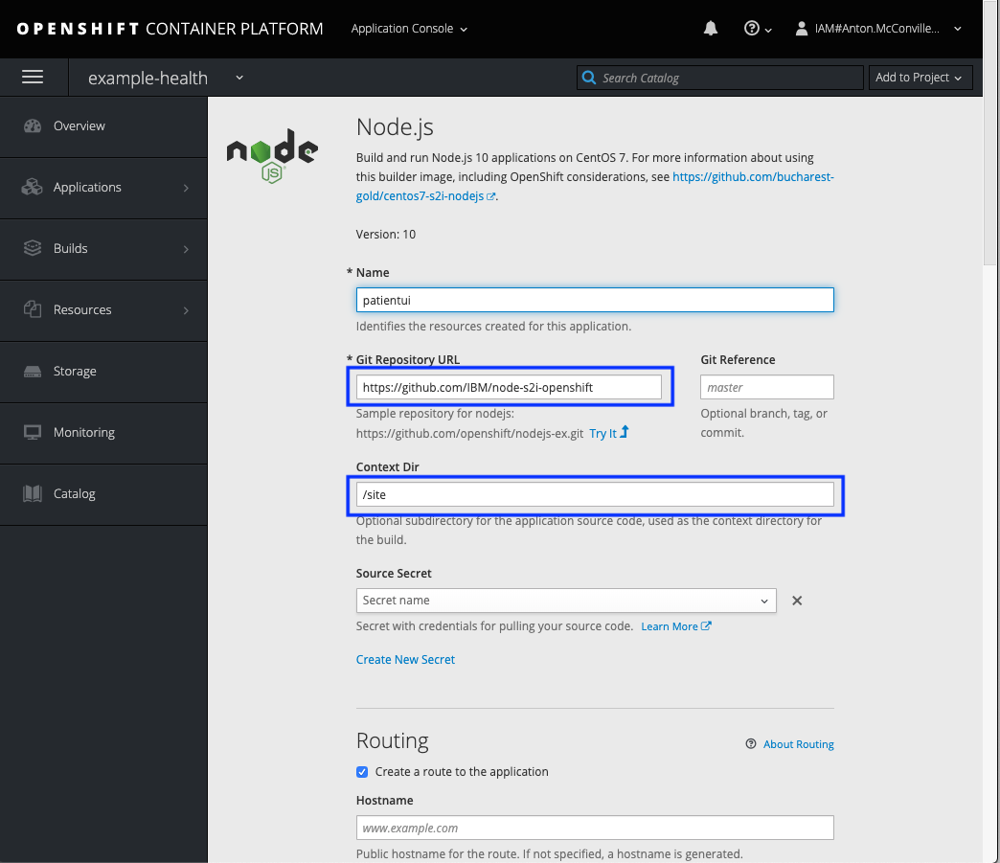
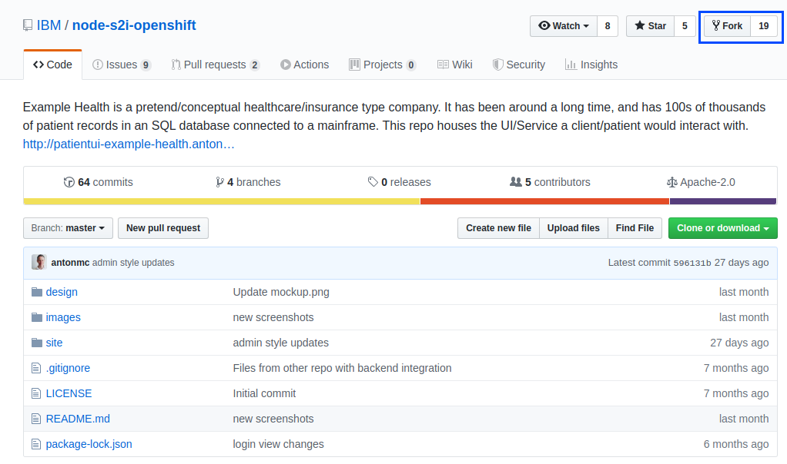
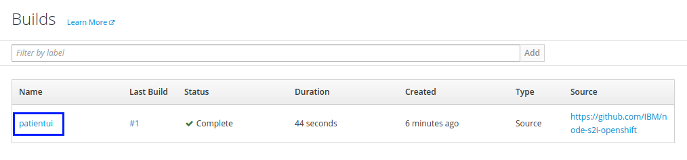
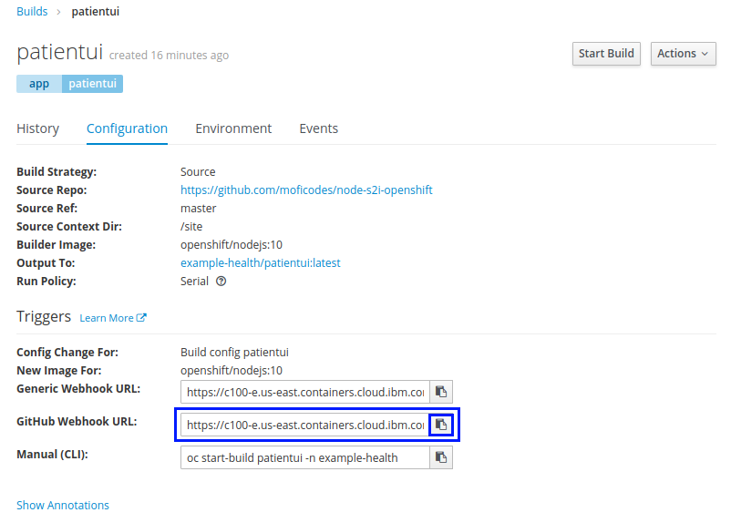
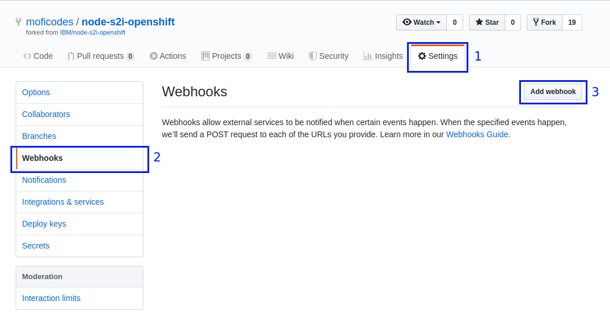
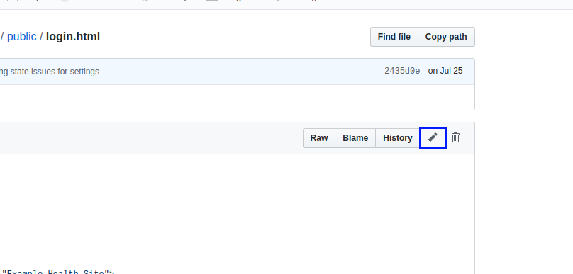
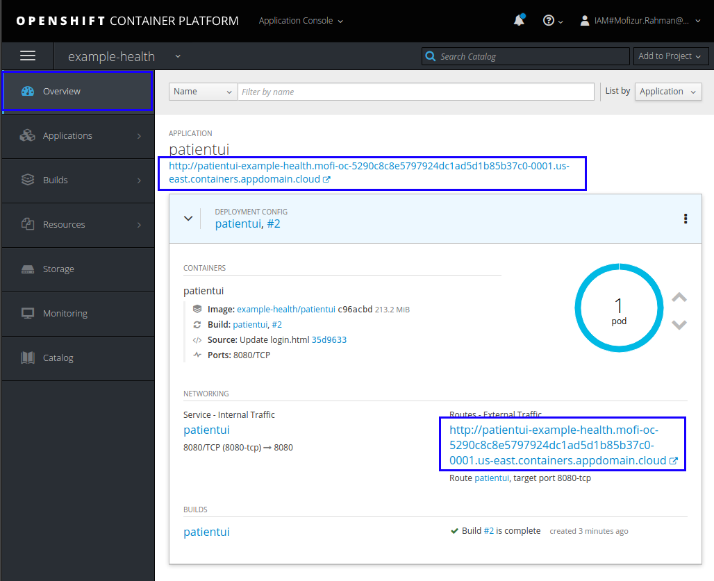
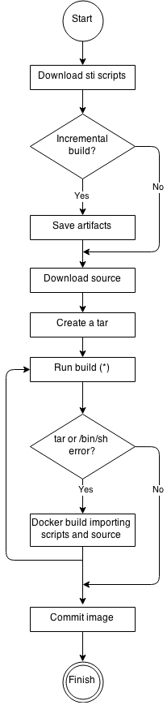
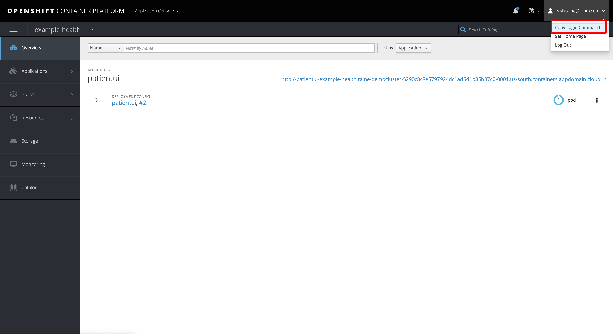

# Exercise 1: Deploying an application using S2I & triggers

In this exercise, you'll deploy a simple Node.js Express application - "Example Health". Example Health is a simple UI for a patient health records system. We'll use this example to demonstrate key OpenShift features throughout this workshop. You can find the sample application GitHub repository here: [https://github.com/IBM/node-s2i-openshift](https://github.com/IBM/node-s2i-openshift)

## Deploy Example Health

Access your cluster on the [IBM Cloud clusters dashboard](https://cloud.ibm.com/kubernetes/clusters). Click the `OpenShift web console` button on the top-right. (This is a pop-up so you'll need to white list this site.)

Create a project, you can title it whatever you like, we suggest "example-health."


Click on your new project. You should see a view that looks like this:


Click on the browse catalog button and scroll down to the `Node.js` image. Click on that catalog button.


Click through to the second step for configuration, and choose `advanced options`. \( a blue hyperlink on the bottom line \)


You'll see an advanced form like this:



Enter the repository: `https://github.com/IBM/node-s2i-openshift` and `/site` for the 'Context Dir'. Click 'Create' at the bottom of the window to build and deploy the application.

Scroll through to watch the build deploying:


When the build has deployed, click the 'External Traffic Route', and you should see the login screen like the following:


You can enter any strings for username and password, for instance `test:test` because the app is running in demo mode.

Congrats! You've deployed a `Node.js` app to Kubernetes using OpenShift Source-to-Image (S2I).

## Understanding What Happened

[S2I](https://docs.openshift.com/container-platform/3.6/architecture/core_concepts/builds_and_image_streams.html#source-build) is a framework that creates container images from source code, then runs the assembled images as containers. It allows developers to build reproducible images easily, letting them spend time on what matters most, developing their code!

## Git Webhooks

So far we have been doing alot of manual deployment. In cloud-native world we want to move away from manual work and move toward automation. Wouldn't it be nice if our application rebuilt on git push events? Git webhooks are the way its done and openshift comes bundled in with git webhooks. Let's set it up for our project.

To be able to setup git webhooks, we need to have elevated permission to the project. We don't own the repo we have been using so far. But since its opensource we can easily fork it and make it our own.

Fork the repo at [https://github.com/IBM/node-s2i-openshift](https://github.com/IBM/node-s2i-openshift)



Now that I have forked the repo under my repo I have full admin priviledges. As you can see I now have a settings button that I can change the repo settings with.


We will come back to this page in a moment. Lets change our git source to our repo.

From our openshift dashboard for our project. Select `Builds > Builds`


Select the patientui build. As of now this should be the only build on screen.



Click on `Action` on the right and then select `Edit`


Change the `Git Repository URL` to our forked repository.

Click Save in the bottom.


You will see this will not result in a new build. If you want to start a manual build you can do so by clicking `Start Build`. We will skip this for now and move on to the webhook part.

Click on `Configuration` tab.

Copy the GitHub Webook URL.

The webhook is in the structure

```text
https://c100-e.us-east.containers.cloud.ibm.com:31305/apis/build.openshift.io/v1/namespaces/example-health/buildconfigs/patientui/webhooks/<secret>/github
```



> There is also the generic webhook url. This also works for github. But the github webhook captures some additional data from github and is more specific. But if we were using some other git repo like bitbucket or gitlab we would use the generic one.

In our github repo go to `Setting > Webhooks`. Then click `Add Webhook`



In the Add Webhook page fill in the `Payload URL` with the url copied earlier from the build configuration. Change the `Content type` to `application/json`.

> **NOTE**: The *Secret* field can remain empty.

Right now just the push event is being sent which is fine for our use.

Click on `Add webhook`


If the webhook is reachable by github you will see a green check mark.

Back in our openshift console we still would only see one build however. Because we added a webhook that sends us push events and we have no push event happening. Lets make one. The easiest way to do it is probably from the Github UI. Lets change some text in the login page.

Path to this file is `site/public/login.html` from the root of the directory. On Github you can edit any file by clicking the Pencil icon on the top right corner.



Let's change the name our application to `Demo Health` (Line 21, Line 22). Feel free to make any other UI changes you feel like.


Once done go to the bottom and click `commit changes`.

Go to the openshift build page again. This happens quite fast so you might not see the running state. But the moment we made that commit a build was kicked off.


In a moment it will show completed. Navigate to the overview page to find the route.



> You could also go to `Applications > Routes` to find the route for the application.

If you go to your new route you will see your change.


# Exercise 2: Understand Buildconfig Strategy Options

## What Is a Build?

A build in OpenShift Container Platform is the process of transforming input parameters into a resulting object. Most often, builds are used to transform source code into a runnable container image.
A build configuration, or BuildConfig, is characterized by a build strategy and one or more sources. The strategy determines the aforementioned process, while the sources provide its input.
The build strategies are:
* Source-to-Image (S2I)
* Pipeline 
* Docker 
* Custom 

And there are six types of sources that can be given as build input:
* Git
* Dockerfile
* Binary
* Image
* Input secrets
* External artifacts

## BuildConfig Object Definition

Lets look for a second where is the BuildConfig takes place inside our Openshift cluster.


We can check our health application to explore the BuildConfig object.
Go back to your openshift console and click on `Builds`


Select the application build


Go to `Configuration` and click on `Actions` -> `Edit YAML`


This is our Health app BuildConfig YAML


* This specification will create a new BuildConfig named patientui.
* The postCommit section defines an optional build hook.
* The runPolicy field controls whether builds created from this build configuration can be run simultaneously. The default value is Serial, which means new builds will run sequentially, not simultaneously.
* The strategy section describes the build strategy used to execute the build. You can specify a Source , Docker, or Custom strategy here. This above example uses the nodejs:10 container image that Source-To-Image will use for the application build.
* The source section defines the source of the build. The source type determines the primary source of input, and can be either Git, to point to a code repository location, Dockerfile, to build from an inline Dockerfile, or Binary, to accept binary payloads. It is possible to have multiple sources at once, refer to the documentation for each source type for details.
* You can specify a list of triggers, which cause a new build to be created.

### Source-to-Image Strategy Options
In the previous build we already used the S2I Strategy so we will try to understand the options and the flexability that we get from it.
First look at the flow diagram below to understand how S2I build works :



There are few options that are in S2I Stragety that I would like to talk about:

1) Incremental Builds - which means it reuses artifacts from previously-built images. This option is basicaly a flag that controls whether an incremental build is attempted. If the builder image does not support incremental builds, the build will still succeed, but you will get a log message stating the incremental build was not successful because of a missing save-artifacts script.
```yaml
strategy:
  sourceStrategy:
    from:
      kind: "ImageStreamTag"
      name: "incremental-image:latest" 
    incremental: true
```

2) Force Pull - allow pulling new image version if its available in the registry to which the image stream points. This flag causes the local builder image to be ignored and a fresh version to be pulled. Setting forcePull to false results in the default behavior of honoring the image stored locally.

```yaml
strategy:
  sourceStrategy:
    from:
      kind: "ImageStreamTag"
      name: "builder-image:latest" 
    forcePull: true
```

3) Extended builds - For compiled languages (Go, C, C++, Java, etc.) the dependencies necessary for compilation might increase the size of the image or introduce vulnerabilities that can be exploited. To avoid these problems, S2I (Source-to-Image) introduces a two-image build process that allows an application to be built via the normal flow in a builder image, but then injects the resulting application artifacts into a runtime-only image for execution.
```yaml
strategy:
  type: "Source"
  sourceStrategy:
    from:
      kind: "ImageStreamTag"
      name: "builder-image:latest"
    runtimeImage: 
      kind: "ImageStreamTag"
      name: "runtime-image:latest"
    runtimeArtifacts: 
      - sourcePath: "/path/to/source"
        destinationDir: "path/to/destination"
```
### Docker Strategy Options

Before we will explain about this strategy lets try it first and now we will use `oc` CLI.
To use it normally you have to install it but to save time we will use IBM Cloud Shell : https://workshop.shell.cloud.ibm.com/
You will have to login with your IBM Cloud user and than use the password : ikslab


1) Select the account with the openshift cluster.
2) Start the terminal.

Now that you have terminal to use with everything you need installed copy the login command from OpenShift web console :



Paste the command in the Cloud Shell in order to be conected to the cluster.


Use the `oc project` command to switch between projects :
```
$ oc project example-health
```

Create a local directory to hold your code:
```
$ mkdir myapp
$ cd myapp
```

Now lets create a Dockerfile that we will use in the docker strategy :
```
$ nano Dockerfile
```

Copy and paste the following docker file 
```
FROM centos:centos7
EXPOSE 8080
COPY index.html /var/run/web/index.html
CMD cd /var/run/web && python -m SimpleHTTPServer 8080
```

To exit use CTRL+X -> y -> enter (save and exit).

We need to add a html file to our app, lets create it :
```
$ nano index.html
```

Paste the following inside the html :
```html
<html>
  <head>
    <title>My local app</title>
  </head>
  <body>
    <h1>Hello World</h1>
    <p>This is my local application</p>
  </body>
</html>
```


To create our build we will use the following command :
```
$ oc new-build --strategy docker --binary --docker-image centos:centos7 --name myapp
```

Start a binary build using the local directory’s content:
```
$ oc start-build myapp --from-dir . --follow
```

Deploy the application using `new-app`, then create a route for it:
```
$ oc new-app myapp
$ oc expose svc/myapp
```

Get the host name for your route and navigate to it:
```
$ oc get route myapp
```

Go to the `HOST/PORT` route in your browser to see the application: 
```
NAME      HOST/PORT                                                                                                          PATH      SERVICES   PORT       TERMINATION   WILDCARD
myapp     myapp-example-health.talne-democluster-5290c8c8e5797924dc1ad5d1b85b37c0-0001.us-south.containers.appdomain.cloud             myapp      8080-tcp                 None
```

After having built and deployed your code, you can iterate by making changes to your local files and starting new builds by invoking `oc start-build myapp --from-dir`. Once built, the code will be automatically deployed and the changes will be reflected in your browser when you refresh the page.

You can go back to Openshift web console and see our new deployed app and the build, go and check the new buildconfig and see the difference.

There are two more things that I would like to cover about docker strategy.

1) Dockerfile Path - By default, Docker builds use a Dockerfile (named Dockerfile) located at the root of the context specified in the `BuildConfig.spec.source.contextDir` field.
The `dockerfilePath` field allows the build to use a different path to locate your Dockerfile, relative to the `BuildConfig.spec.source.contextDir` field. It can be simply a different file name other than the default Dockerfile (for example, MyDockerfile), or a path to a Dockerfile in a subdirectory (for example, dockerfiles/app1/Dockerfile):
```yaml
strategy:
  dockerStrategy:
    dockerfilePath: dockerfiles/app1/Dockerfile
```

2) No Cache - Docker builds normally reuse cached layers found on the host performing the build. Setting the `noCache` option to true forces the build to ignore cached layers and rerun all steps of the Dockerfile:
```yaml
strategy:
  dockerStrategy:
    noCache: true
```

### Pipeline Strategy Options

The Pipeline build strategy allows developers to define a Jenkins pipeline for execution by the Jenkins pipeline plugin. The build can be started, monitored, and managed by OpenShift Container Platform in the same way as any other build type.

Lets create our own Pipeline Strategy.
Create a new directory for your application:
```
$ mkdir mavenapp
$ cd mavenapp
```

Create a `Dockerfile` that copies a WAR to the appropriate location inside a wildfly image for execution. 
```
$ nano Dockerfile
```

Copy the following to a local file named `Dockerfile`:
```
FROM wildfly:latest
COPY ROOT.war /wildfly/standalone/deployments/ROOT.war
CMD  $STI_SCRIPTS_PATH/run
```

As you can see we will need a `ROOT.war` file in order to run this application.
Download the `ROOT.war` from the workshop git :
```
$ git clone https://github.com/tal2k4xj/devocps-workshop.git
$ cd devocps-workshop
$ mv ROOT.war ../ROOT.war
$ cd ..
``` 

Create a new BuildConfig for that Dockerfile:
```
$ cat Dockerfile | oc new-build -D - --name mavenapp
```

Create a BuildConfig with the Jenkins pipeline that will build a WAR and then use that WAR to build an image using the previously created `Dockerfile`. The same pattern can be used for other platforms where a binary artifact is built by a set of tools and is then combined with a different runtime image for the final package. 

Create `mavenapp-pipeline.yml`:
```
$ nano mavenapp-pipeline.yml
```

Save the following code to `mavenapp-pipeline.yml`:
```yaml
apiVersion: v1
kind: BuildConfig
metadata:
  name: mavenapp-pipeline
spec:
  strategy:
    jenkinsPipelineStrategy:
      jenkinsfile: |-
        pipeline {
          agent { label "maven" }
          stages {
            stage("Clone Source") {
              steps {
                checkout([$class: 'GitSCM',
                            branches: [[name: '*/master']],
                            extensions: [
                              [$class: 'RelativeTargetDirectory', relativeTargetDir: 'mavenapp']
                            ],
                            userRemoteConfigs: [[url: 'https://github.com/openshift/openshift-jee-sample.git']]
                        ])
              }
            }
            stage("Build WAR") {
              steps {
                dir('mavenapp') {
                  sh 'mvn clean package -Popenshift'
                }
              }
            }
            stage("Build Image") {
              steps {
                dir('mavenapp/target') {
                  sh 'oc start-build mavenapp --from-dir . --follow'
                }
              }
            }
          }
        }
    type: JenkinsPipeline
  triggers: []
```

Create the pipeline build. If Jenkins is not deployed to your project, creating the BuildConfig with the pipeline will result in Jenkins getting deployed. It may take a couple of minutes before Jenkins is ready to build your pipeline. You can check the status of the Jenkins rollout by invoking, `oc rollout status dc/jenkins`:
```
$ oc create -f ./mavenapp-pipeline.yml
```

Once Jenkins is ready, start the pipeline defined previously:
```
$ oc start-build mavenapp-pipeline
```
As said before this might take few minutes to complete so while we wait lets explore our pipline.
Go to Openshift web console and click on `Builds` -> `Pipelines` and click on the build.


When the pipeline build finish you can go back to the Cloud Shell and continue to create our app.
When the pipeline has finished building, deploy the new application using new-app and expose its route:
```
$ oc new-app mavenapp
$ oc expose svc/mavenapp
```

Using your browser, navigate to the route for the application:
```
$ oc get route mavenapp
```

### Custom Strategy Options

The Custom build strategy allows developers to define a specific builder image responsible for the entire build process. Using your own builder image allows you to customize your build process.
By allowing you to define a specific builder image responsible for the entire build process, OpenShift Container Platform’s Custom build strategy was designed to fill a gap created with the increased popularity of creating container images. When there is a requirement for a build to still produce individual artifacts (packages, JARs, WARs, installable ZIPs, and base images, for example), a Custom builder image using the Custom build strategy is the perfect match to fill that gap.

#### References 
https://github.com/IBM/openshift101/tree/master/workshop
https://docs.openshift.com/container-platform/3.4/dev_guide/builds/build_strategies.html
https://docs.openshift.com/container-platform/3.4/architecture/core_concepts/builds_and_image_streams.html
https://docs.openshift.com/aro/dev_guide/dev_tutorials/binary_builds.html#binary-builds-local-code-changes

